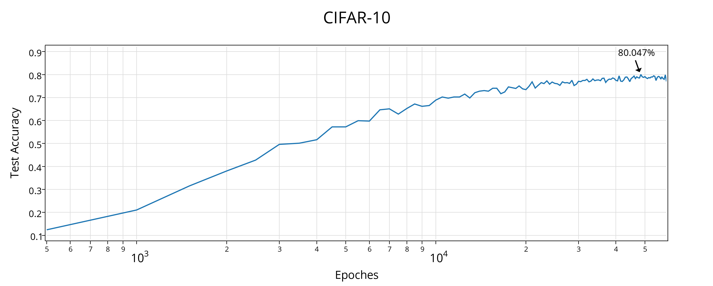
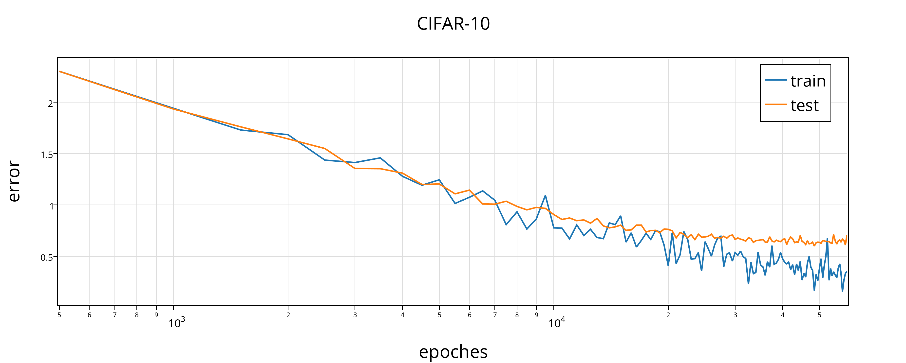

## 说明

CIFAR-10 分类模型(基于 caffe ), 在测试集上准确率可达 80%

## 模型

* ###框架###

3 层卷积层 + 2 层全连接层 + softmax

* ###新技术###

所有非线性变换均采用 ReLU, 前两层卷积层后面加入 pool 和 local response nomalization, 两个全连接层均采用了 dropout 技术.

* ###模型细节###

pad1-conv1-relu1-pool1-lrn1-pad2-conv2-relu2-pool2-lrn2-conv3-relu3-fc4-relu4-dropout4-fc5-relu5-dropout5-softmax

* ###曲线###

训练过程中的 error 和 acccuracy 曲线如下:

   

   
